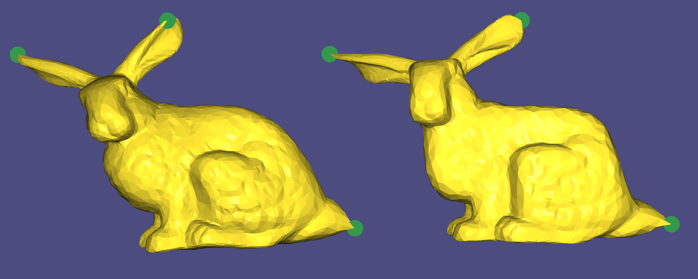

# Cubic Stylization

This tutorial will introduce <a href="https://arxiv.org/pdf/1910.02926.pdf">Cubic Stylization [Liu & Jacobson 2019]</a>, a method to deform the input mesh into a cubic stylized mesh. Generally, the method adds a new L1 regularization on the deformation with ARAP energy optimization. By regularizing each vertex normals to align with the axis, the mesh can have a cubic style, while maintain the local shape. 

# Problem Setup

Given a triangle mesh as a set of vertices $V\in \mathbb R^{n\times 3} $ and a set of faces $F\in\mathbb R^{m\times 3}$. We want to output a deformed shape $\tilde V$. The output shape will have each sub-component in the style of axis-aligned cubes and will remain the geometric details of the original mesh. 

# Method

The problem is view as an energy optimization problem. We want to minimize the ARAP energy with a L1 regularization. Denote the edges at rest state as $d_{ij} = v_j-v_i$ and at deformed states as $\tilde d_{ij} = \tilde v_j - \tilde v_i$, we can write the optimization problem as 
\begin{align*}
\text{minimize} \quad&\sum_{i\in V}\sum_{j\in \mathcal N(i)} \frac{w_{ij}}{2}\|R_id_{ij} - \tilde d_{ij}\|_F^2 + \lambda a_i \|R_i\tilde n_i\|_1\\
\text{subject to} \quad& \tilde V, R_1,..., R_n
\end{align*}
The first term is the <a href="https://github.com/alecjacobson/geometry-processing-deformation/blob/master/papers/GeomElastic.pdf">ARAP energy [Sorkine & Alexa 2007]</a> where $R_i$ is the rotation matrix and $w_{ij}$ is the cotangent weight and $\mathcal N(i)$ is the neighboring of vertex $i$ (for example. two-rings as from the deformation assignment).  
The second term is the new, added L1 regularization. $\hat n_i$ denotes the area-weighted unit normal vector of $v_i$ and $a_i$ is the barycentric area of $v_i$ and $\lambda$ is a tuning parameter. 

## Optimizing the energy

Generally, we follow the local global step as ARAP energy optimization, i.e. for each iteration, we first optimize the rotations with constant vertex positions, and then optimize vertices with constant rotations. 

### Local Step
The local step involves finding the rotation matrix $R_1,..., R_n$, i.e. For each vertex $i$, we are to optimize 
$$R_i^* = \arg\min_{R_i\in SO(3)}\sum_{j\in \mathcal N(i)} \frac{w_{ij}}{2}\|R_id_{ij} - \tilde d_{ij}\|_F^2 + \lambda a_i \|R_i\tilde n_i\|_1$$
note that the ARAP energy can be expressed in a matrix formations
$$\frac12 (R_iD_i-\tilde D_i)^T W_i (R_iD_i-\tilde D_i)$$
where $D_i,\tilde D_i \in \mathbb R^{3\times |\mathcal N(i)|}$ are stacked rim/spoke edge vectors and $W_i$ is the diagonal matrix of $w_1,...,w_n$. Then, write $z = R_i\hat n_i$, we can turn the formation into
\begin{align*}
\text{minimize}_{z_, R_i} \quad &\frac12 (R_iD_i-\tilde D_i)^T W_i (R_iD_i-\tilde D_i)+\lambda a_i\|z\|_1\\
\text{subject to} \quad &z-R_i\hat n_i = 0
\end{align*}
We can solve the local step using the scaled-form <a href="https://web.stanford.edu/~boyd/papers/pdf/admm_slides.pdf">ADMM</a> updates. 

Applying ADMM, the update steps are 
\begin{align*}
R_i^{k+1} &= \arg\min \frac12(R_iD_i-\tilde D_i)^T W_i (R_iD_i-\tilde D_i) +\frac{\rho^k}2\|R_i\hat n_i - z^k + u^k\|_2^2\\
z^{k+1} &= \arg\min \lambda a_i \|z\|_1 + \frac{\rho^k}2\|R_i^{k+1} \hat n_i - z + u^k\|_2^2\\
\tilde u^{k+1} &= u^k + R_i^{k+1} \hat n_i - z^{k+1}\\
\rho^{k+1}, u^{k+1} &= update(\rho^k)
\end{align*}

Then, consider each update, 

The rotation update can be viewed as 
\begin{align*}
R_i^{k+1} &= \arg\max tr(R_i M_i)\\
M_i &= \begin{bmatrix}[D_i]&[\hat n_i]\end{bmatrix}
\begin{bmatrix}[W_i]&0\\0&\rho^k\end{bmatrix}
\begin{bmatrix}[\tilde D_i]\\ [(z^k-u^k)^T] \end{bmatrix}
\end{align*}
This becomes an Orthogonal Procrustes problem, and the solution given by $M = U\Sigma V^T$ through single value decomposition, and then $$R = UV^T$$ up to $det(R) > 0$ by alternating the sign of $U$'s column.  

The $z$ update is an instance of lasso problem [Boyd et al. 2011], which can be solved with a shrinkage step
$$z^{k+1} = S_{\lambda a_i/\rho^k}(R_i^{k+1}\hat n_i + u^k)$$
where the shrinkage is defined as 
$$S_\chi(x_j) = (1-\frac{\chi}{|x_j|}) + x_j$$

### Global Step
Note that when we optimize $V$, there is no $v_i$ in the L1 penalty term, hence we are simply optimizing ARAP energy as in the deformation assignment. 

## Algorithm
Similar to deformation, we can precompute the topology properties since the stylization only change the geometry. Therefore the rough algorithm goes as
```
cubic_stylization(V, F, lambda):
    pre_computation(V, F)
    V_tilde <- V
    R <- initalize()
    while not converge:
        R <- local_step(V, V_tilde, lambda)
        V_tilde <- global_step(R)
```

# Implementation

In this project, we used `cubic_style_data ` to store all the properties and states of the stylization. We implemented `cubic_style_precomputation`, which computes the precomputated properties and initialize the parameters and states for the optimization problem, and `cubic_style_single_iteration`, which do 1 iteration of local step and global step. 

Here is a example code snippet
``` cpp
// initialize data
cubic_style_data cubic_data;
Eigen::MatrixXd V_tilde;
lambda = 0.1 // The parameter for cubic_stylization

// b is the snap points for deformation
// bc is the position of the handle points
cubic_style_precomputation(V, F, b, cubic_data)
for (int i = 0; i < MAXITER; i++) {
    cubic_style_single_iteration(cubic_data, bc, lambda, V_tilde)
}
```

# Example Results


_different cubic stylized meshes_

$\lambda \in \mathbb R^+$ is the parameter to control the "cubic-ness" of the mesh. Note that $\lambda$ is not scale invariant. 


_Different $\lambda$'s on the bunny mesh_

As mentioned in the paper, since we are still doing ARAP energy optimization, deformation is still available with the stylized mesh. 


_deformation with original mesh and cubic stylized mesh_
